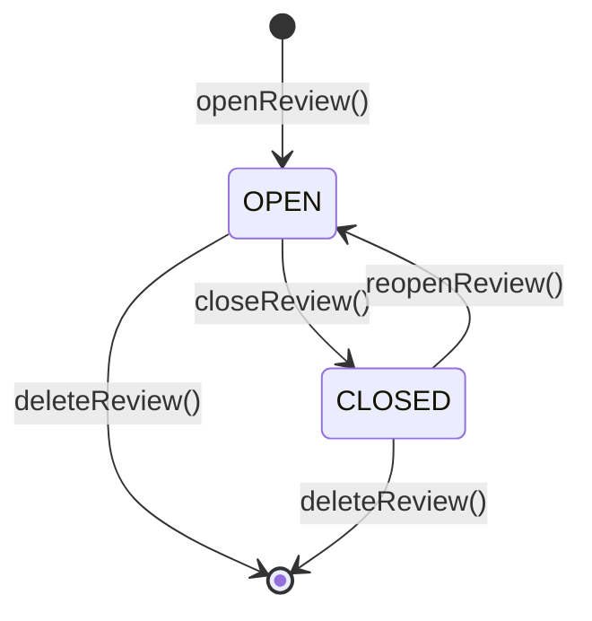

# Concepts LAMal

Ce document explique l'assurance maladie suisse à un développeur qui n'y connaît rien, puis le
« rituel » d'automne tel que l'app le modélise. Chaque notion suit le même plan : ce que c'est
dans la vraie vie, puis où elle vit dans le code.

Pour la traduction des mots de l'interface en identifiants de code, voir le
[glossaire](glossaire.md). Pour les tables, voir le [modèle de données](modele-de-donnees.md).

> Les montants sont toujours stockés en centimes entiers (`Rappen`, suffixe `Rp`/`_rp`).
> « CHF 400.00 » s'écrit `40_000` dans le code.

## 1. L'assurance de base

### LAMal

L'assurance obligatoire des soins (loi fédérale sur l'assurance maladie, LAMal). Toute personne
domiciliée en Suisse doit l'avoir. Les prestations sont **les mêmes chez toutes les caisses** :
seuls le prix et le service changent. Une caisse ne peut refuser personne. C'est pourquoi changer
de caisse chaque année pour payer moins est sans risque, et c'est tout l'objet de l'app.

On a un contrat LAMal par personne et par année civile (1er janvier au 31 décembre).

Code : `src/domain/lamal.ts` (vocabulaire), table `lamal_policy`.

### Caisse (assureur)

Une caisse-maladie reconnue par l'OFSP. Chacune a un numéro OFSP (en allemand BAG, d'où
`bag_number`). Les adresses viennent de l'annuaire officiel des assureurs.

Code : table `insurer`, référentiel dans `src/infrastructure/reference/insurer-directory.ts`.

### Prime mensuelle

Le prix de l'assurance, payé chaque mois. Elle dépend de la caisse, du modèle, de la franchise,
de la région, de la classe d'âge et de la couverture accident. Elle change chaque 1er janvier.

L'app distingue deux primes :

- la prime **officielle** publiée par l'OFSP (`premium.monthly_rp`) ;
- la prime **réellement facturée**, lue sur la police (`lamal_policy.billed_monthly_rp`). Elle
  peut différer (rabais, arrondis).

### Franchise

Le montant annuel des frais de santé que l'assuré paie lui-même avant que la caisse ne
rembourse. Plus la franchise est haute, plus la prime est basse.

| Classe d'âge | Franchises possibles (CHF) |
|---|---|
| Enfant | 0, 100, 200, 300, 400, 500, 600 |
| Jeune adulte et adulte | 300, 500, 1000, 1500, 2000, 2500 |

Code : `LEGAL_DEFAULT_FRANCHISES_ADULT`, `LEGAL_DEFAULT_FRANCHISES_KID` et `franchisesFor()` dans
`src/domain/parameters.ts`.

### Quote-part

Au-delà de la franchise, l'assuré paie encore **10 %** des frais, jusqu'à un plafond annuel :
**CHF 700** pour un adulte ou un jeune adulte, **CHF 350** pour un enfant.

Code : `coinsuranceRateBp` (en points de base : `1000` = 10 %), `coinsuranceMaxFor()` dans
`src/domain/parameters.ts`.

### Paramètres légaux par année

Franchises, quote-part et redistribution CO2 peuvent changer avec la loi. Ils sont donc rangés
**par année** dans la table `lamal_parameters`, qui fait foi. Les constantes `LEGAL_DEFAULT_*`
ne sont qu'un repli, utilisé quand l'année n'a pas encore de ligne (`parametersFor()` dans
`src/infrastructure/db/queries.ts`).

Code : `LamalParameters`, `defaultParameters()` dans `src/domain/parameters.ts`.

### Redistribution CO2

La Confédération reverse chaque année à chaque habitant une part de la taxe sur le CO2, en
déduction de la prime d'assurance maladie (par exemple CHF 57.00 pour 2027). L'app la soustrait
de la prime pour comparer des coûts réels. Le montant officiel vient de l'OFEV ; un montant
saisi à la main reste prioritaire (`co2_source` = `USER`).

Code : `lamal_parameters.co2_annual_rp`, `src/infrastructure/reference/co2.ts`.

### Coût total attendu

Comparer les primes seules trompe : une franchise haute baisse la prime mais coûte cher en cas
de maladie. L'app classe donc les offres selon le coût annuel complet :

```
coût total = 12 × prime mensuelle
           − redistribution CO2
           + min(frais de santé, franchise)
           + min(10 % × (frais − franchise si positif), plafond de quote-part)
```

Les « frais de santé » sont une estimation des factures de l'année (par défaut CHF 500,
`DEFAULT_HEALTH_COSTS_RP`), affinée par le questionnaire des besoins (profils `RARE`, `FEW`,
`REGULAR`, `HEAVY` de `src/domain/strategy.ts`). La contribution hospitalière (CHF 15 par jour)
est hors modèle.

**Exemple chiffré.** Un adulte en 2027, frais attendus CHF 3'500 (profil « Suivi régulier »),
CO2 CHF 57.00.

| | Franchise 300, prime 400.00 | Franchise 2500, prime 330.00 |
|---|---:|---:|
| Primes : 12 × prime | 4'800.00 | 3'960.00 |
| − CO2 | −57.00 | −57.00 |
| Franchise payée : min(3'500, franchise) | 300.00 | 2'500.00 |
| Quote-part : 10 % de (3'500 − franchise), plafond 700 | 320.00 | 100.00 |
| **Coût total attendu** | **5'363.00** | **6'503.00** |

La prime la plus basse n'est pas la moins chère ici. L'app montre aussi deux autres scénarios
(`costScenarios()`) : « sans frais » (prime nette seule : 4'743.00 et 3'903.00) et « année
chargée » (franchise et quote-part maximales : 5'743.00 et 7'103.00).

Code : `annualCost()`, `costScenarios()`, `franchiseCurve()` (simulateur de franchise) et
`breakEvenRp()` (point de bascule entre franchises) dans `src/domain/cost.ts`.

### Classe d'âge

La prime dépend de trois classes. Seule **l'année de naissance** compte, pas le jour :
on calcule `âge = année de couverture − année de naissance`.

| Code | Classe | Âge dans l'année |
|---|---|---|
| `KID` | Enfant | 0 à 18 |
| `YOUNG` | Jeune adulte | 19 à 25 |
| `ADULT` | Adulte | 26 et plus |

Quand une personne change de classe au 1er janvier, le rituel l'avertit (`ageTransition()`) :
un enfant qui passe jeune adulte perd les franchises enfant et doit en choisir une d'adulte.

Distinct de la classe d'âge, `isMinorOn()` dit si la personne est **mineure** à une date (date
complète) : un mineur ne signe pas ses lettres, un parent signe pour lui.

Code : `ageClassForYear()`, `ageTransition()`, `isMinorOn()` dans `src/domain/age.ts` ;
type `AgeClass` dans `src/domain/lamal.ts`.

### Sous-groupe

L'OFSP découpe certaines classes en sous-groupes. L'app s'en sert surtout pour les enfants :
l'échelon de rabais enfant (`K1` = tarif normal, `K3`, `K4`, `K5`) lu sur la police. Les autres
classes utilisent le sous-groupe par défaut (`J1` jeune adulte, `E1` adulte).

Code : `KID_SUBGROUPS`, `subgroupFor()` dans `src/domain/lamal.ts`, colonne `person.kid_subgroup`.

### Région de primes

Chaque canton est découpé en une à trois régions de primes (les villes coûtent souvent plus
cher). La région dépend de la **commune** de domicile, pas seulement du canton. Un canton sans
découpage a la région `0`.

Un code postal peut couvrir plusieurs communes, parfois de régions différentes. L'app propose
donc les communes d'un code postal, de la plus probable à la moins probable, et l'utilisateur
confirme. La région figure aussi sur la police.

Code : `lookupPostalCode()` dans `src/infrastructure/regions/postal.ts` (table générée par
`scripts/build-postal-regions.ts`) ; colonnes `household.canton`, `household.region`,
`household.bfs_number` (n° OFS de la commune).

### Couverture accident

La LAMal couvre aussi les accidents, sauf si la personne est déjà assurée par son employeur
(LAA, à partir de 8 heures de travail par semaine). Dans ce cas on peut **exclure l'accident**,
et la prime baisse un peu.

Code : `person.employed_accident_cover`, `lamal_policy.accident`, `premium.accident`.

### Modèles d'assurance

Un modèle alternatif donne un rabais en échange d'un parcours imposé : on s'engage à consulter
d'abord un premier interlocuteur.

| Code | Modèle | Premier recours |
|---|---|---|
| `STANDARD` | Libre choix | Le médecin de son choix |
| `PRAXIS` | Médecin de famille / HMO | Son médecin de famille ou un cabinet de groupe |
| `TELMED` | Télémédecine | Un centre de conseil par téléphone ou application |
| `PHARMACY` | Pharmacie | Une pharmacie partenaire |
| `FLEX` | Flexible | Au choix, parmi une liste |
| `OTHER` | Autre | Selon le règlement de la caisse |

Pour `PRAXIS`, `FLEX` et `OTHER`, il faut vérifier que son médecin figure dans la liste de la
caisse (`requiresDoctorCheck()`, colonne `review_line.doctor_check`). L'OFSP ne publie pas ces
listes.

Code : `ModelType`, `MODEL_LABEL`, `MODEL_DETAILS` dans `src/domain/lamal.ts`.

### Tarif

Une caisse vend plusieurs produits : un par modèle, parfois plusieurs par modèle. Chacun a un
**code tarif** (ex. `HEL-TEL26`) et un libellé. Une prime est le prix d'un tarif pour une
combinaison région × classe d'âge × sous-groupe × accident × franchise.

Code : tables `tariff` et `premium`.

## 2. Les complémentaires (LCA)

Les assurances complémentaires (hospitalisation en chambre privée, dentaire, médecines
douces…) relèvent d'une autre loi, la LCA. Ce sont des **contrats privés** :

- la caisse peut **refuser** un nouveau client selon son état de santé ;
- elles ont leurs propres durées et délais de résiliation ;
- résilier la LAMal ne résilie **pas** la LCA, même chez le même groupe.

D'où le **garde-fou LCA** : avant qu'une lettre de résiliation LAMal puisse être générée, la
personne doit confirmer explicitement qu'elle a vérifié ses complémentaires. Le message
principal : « ne résiliez jamais une LCA avant d'avoir l'acceptation écrite d'une nouvelle ».
Dans l'interface, la couleur ambre (jeton CSS `--lca` de `src/app/globals.css`) est réservée à
ces alertes.

L'OFSP ne publie pas les tarifs LCA : l'app ne les compare pas. Elle aide seulement à les
demander à la nouvelle caisse (demande d'offre).

Code : garanties `LCA_GUARANTEES` dans `src/domain/lca.ts` ; `lcaWarnings()` et `checkLetter()`
dans `src/domain/review.ts` ; table `lca_policy` ; confirmation `review_line.lca_ack_at`.

## 3. Changer de caisse

### Reconduction tacite

Sans rien faire, le contrat continue l'année suivante chez la même caisse, avec le même modèle
et la même franchise, au nouveau prix. L'app calcule cette « reconduction » pour montrer la
hausse et servir de point de comparaison.

### Lignée de tarif

Pour calculer la reconduction, il faut retrouver le tarif de l'an prochain qui succède au tarif
actuel. Souvent le code est identique, mais il change parfois (casse, libellé ajouté, nouveau
nom). `findRenewal()` essaie dans l'ordre : correspondance déjà confirmée par le foyer, code
identique, ancien code contenu dans le nouveau, libellé le plus proche, seul tarif du même
modèle. Le résultat a un statut :

| Statut | Sens |
|---|---|
| `MATCHED` | Certain (code identique ou correspondance confirmée) |
| `PROBABLE` | Déduit du libellé ou du modèle : à faire confirmer |
| `AMBIGUOUS` | Plusieurs candidats : l'utilisateur choisit |
| `MISSING` | La caisse n'a plus d'offre pour ce profil |

Quand l'utilisateur confirme une correspondance, elle est enregistrée pour son foyer dans
`tariff_lineage` (`confirmLineage()`). Si la franchise actuelle n'existe plus (passage enfant →
adulte), `nearestFranchise()` prend la plus proche.

Code : `src/domain/renewal.ts`, `renewalFor()` dans `src/application/review/lines.ts`.

### Échéances de résiliation

Pour changer de caisse au 1er janvier :

1. Les caisses doivent annoncer la nouvelle prime au plus tard le **31 octobre**
   (`insurerNoticeBy`).
2. La lettre de résiliation doit être **reçue** par la caisse au plus tard le **30 novembre**
   (`receiptDeadline`). Si le 30 novembre tombe un week-end, l'app vise par prudence le vendredi
   précédent.
3. L'app conseille d'envoyer le recommandé **7 jours avant** (`POSTAL_MARGIN_DAYS`), ramené
   lui aussi au jour ouvrable précédent (`sendBy`). C'est la marge d'acheminement et de retrait
   au guichet.
4. La résiliation prend effet le **31 décembre** (`effectiveEnd`).

Exemples : pour 2027, réception le lundi 30.11.2026 et envoi conseillé le lundi 23.11.2026.
Pour 2026, le 30.11.2025 était un dimanche : réception le vendredi 28.11.2025, envoi le
vendredi 21.11.2025.

L'urgence affichée (`urgency()`) vaut `calm`, `soon` (envoi dans 14 jours au plus), `urgent`
(date d'envoi conseillée passée) ou `late` (délai de réception passé).

La **fenêtre du rituel** est ouverte quand les primes de l'année cible sont publiées et que le
délai de réception n'est pas passé (`isReviewWindowOpen()`). L'année cible est toujours l'année
civile suivante (`reviewTargetYear()` dans `src/server/context.ts`).

Code : `reviewDeadlines()`, `urgency()`, `isReviewWindowOpen()` dans `src/domain/deadlines.ts`.

### Rappels

Avant la date d'envoi conseillée, l'app envoie des rappels à J-30, J-14, J-7, J-3 et J-1
(`REMINDER_OFFSETS`), seulement aux foyers qui ont encore un courrier à poster (ou rien
préparé). Un dernier rappel part deux jours après la date conseillée s'il reste des courriers.
Enfin, une relance part quand une caisse n'a pas confirmé **21 jours** après l'envoi
(`CONFIRMATION_FOLLOW_UP_DAYS`). Les rappels sont des notifications ; J-7, J-1, le dernier
rappel et les relances partent aussi par courriel, sans nom de caisse.

Code : `letterReminders()` dans `src/domain/reminders.ts`, `src/application/reminders.ts`.

### Demande d'affiliation

Avant de résilier, il faut être **accepté** par la nouvelle caisse : on lui demande
l'affiliation (formulaire ou courrier). L'ancienne caisse ne libère l'assuré qu'à réception de
la confirmation de la nouvelle. L'app produit cette demande (PDF et courriel prérempli) avec les
complémentaires souhaitées : c'est la **demande d'offre**.

Code : table `offer_request`, `src/application/offers.ts`, colonnes
`review_line.affiliation_requested_at` et `affiliation_confirmed_at`.

### Lettres

Deux sortes de lettres à la caisse **actuelle** :

| `letter.kind` | Quand | Contenu |
|---|---|---|
| `TERMINATION` | Changement de caisse (`SWITCH`) | Résiliation de la LAMal au 31 décembre |
| `CHANGE` | Même caisse, autre franchise ou modèle (`ADJUST`) | Demande de modification au 1er janvier |

Une lettre fige son contenu à la génération (`letter.content`) : elle ne change plus ensuite.
Elle peut être imprimée et postée par l'utilisateur, ou confiée à Pingen (impression et
recommandé) quand l'administrateur l'a autorisé pour le foyer.

Code : `buildLetter()` dans `src/domain/letter.ts`, `checkLetter()` dans `src/domain/review.ts`,
`src/application/letters.ts`, `src/domain/pingen.ts`.

## 4. Les données de l'OFSP

L'Office fédéral de la santé publique publie chaque fin septembre toutes les primes de l'année
suivante en open data (opendata.swiss, fichier `Prämien_CH.xlsx`, en-têtes en allemand). Une
ligne = une caisse × canton × région × classe d'âge × sous-groupe × accident × tarif × franchise
→ prime mensuelle.

- **Archives** : un fichier par année (`Archiv_Praemien_AAAA.zip`), utilisables depuis **2015**
  (`MIN_ARCHIVE_YEAR`). Avant, la couverture accident n'est pas identifiable avec certitude.
- **Changement de codes en 2027** : l'OFSP a renommé tous ses codes (`PR-REG CH1` devient
  `PR_REG_1`, `AKL-ERW` devient `AKA_03_ERW`, `FRA-300` devient `FRA_01_E_0300`, les types
  `TAR-BASE/HAM/HMO/DIV` deviennent `BASE/PRAXIS/FLEX/TEL_DIG/PHARM`). Le lecteur comprend les
  deux générations et les ramène à une seule forme. Une ligne illisible est rejetée et comptée,
  jamais devinée.
- **Jeu de primes** : chaque fichier importé devient un jeu immuable (`tariff_dataset`),
  identifié par son empreinte SHA-256 et validé avant d'être activé. Un nouveau fichier pour la
  même année remplace l'actif ; l'ancien passe `SUPERSEDED`.
- **Autres référentiels officiels** : annuaire des assureurs (adresses), données de
  surveillance (réserves, frais administratifs, utilisés pour le portrait des caisses et la
  stratégie Équilibre) et montants CO2.

Ce que l'open data ne contient pas : les listes de médecins des modèles et les tarifs LCA.

Code : `src/domain/ofsp/normalize.ts` (lecture d'une ligne), `src/infrastructure/ofsp/`
(téléchargement, import en flux), `src/infrastructure/reference/`. Le fonctionnement des imports
automatiques est décrit dans [architecture.md](architecture.md).

## 5. Le rituel d'automne

Le rituel est la revue annuelle d'un foyer : comparer, décider, envoyer les courriers, puis
enregistrer les contrats de l'année suivante. Il y a un rituel par foyer et par année cible
(table `review`), et une **ligne** par personne (table `review_line`).

Le déroulé côté utilisateur est dans le [guide utilisateur](guide-utilisateur.md#le-rituel-dautomne).

### Ouverture

Le rituel s'ouvre seul pendant la fenêtre du rituel, dès que les primes de l'année cible sont
importées et qu'au moins une personne a un contrat pour l'année en cours
(`openReviewIfPossible()`). `openReview()` crée une ligne par personne qui a un contrat et y
calcule la reconduction. Il est idempotent : les lignes non décidées sont recalculées (par
exemple après un nouvel import), les lignes décidées ne bougent plus.

Code : `src/application/review/open.ts`.

### Statuts du rituel



Seuls `OPEN` et `CLOSED` sont écrits. `DECIDED` et `LETTERS_SENT` existent encore dans le type
`ReviewStatus` et dans le schéma, mais ce sont des valeurs historiques que le code n'écrit plus.

### Stratégies

Avant de comparer, le foyer choisit une stratégie (`review.strategy`). Elle règle les filtres
par défaut et l'ordre de classement.

| Code | Interface | Filtres par défaut | Classement |
|---|---|---|---|
| `ECONOMY` | Économie max | Tous les modèles, meilleure franchise | Coût total attendu |
| `KEEP` | Maintien | Même modèle, même franchise | Coût total attendu |
| `BALANCE` | Équilibre | Modèles acceptés par la personne, meilleure franchise | Coût corrigé de la solidité de la caisse |

Pour `BALANCE`, chaque caisse reçoit de −3 à +3 points de solidité (réserves, frais
administratifs, hausses passées). Chaque point vaut un bonus ou malus de 3 % du coût
(`QUALITY_WEIGHT_PERMILLE` = 30).

Code : `strategyDefaults()`, `qualityPoints()`, `rankForStrategy()` dans `src/domain/strategy.ts`.

### Besoins

Le questionnaire des besoins fixe, par personne, les frais de santé attendus
(`person.health_costs_rp`), la franchise souhaitée (`review_line.wish_franchise_chf`, null =
l'app cherche la meilleure) et les modèles acceptés (`review_line.wish_models`). Sa validation
remplit `review.needs_confirmed_at`.

### Décision d'une ligne

| `review_line.decision` | Interface | Courrier |
|---|---|---|
| `UNDECIDED` | À décider | Aucun |
| `KEEP` | Je garde | Aucun |
| `SWITCH` | Je change de caisse | Demande d'affiliation, puis résiliation (`TERMINATION`) |
| `ADJUST` | Je change de franchise ou de modèle | Modification (`CHANGE`) |

L'utilisateur ne choisit pas la décision : il choisit une offre, et `decide()` en déduit la
décision. Même caisse, même tarif et même franchise que la reconduction : `KEEP`. Même caisse
mais autre chose : `ADJUST`. Autre caisse : `SWITCH`. Le choix est **figé** dans la ligne
(`chosen_*` : caisse, tarif, franchise, prime, coût total) : un réimport des primes ne le
réécrit pas.

Code : `src/application/review/decisions.ts`, `DECISION_LABEL` dans `src/domain/review.ts`.

### Étapes affichées

La page du rituel montre une frise de six étapes, calculée à partir de l'état des lignes :

| Clé | Libellé | Cochée quand |
|---|---|---|
| `renewal` | Hausse | La nouvelle prime de chaque personne est connue |
| `strategy` | Stratégie | Une stratégie est choisie (ou tout est déjà décidé) |
| `needs` | Besoins | Les besoins sont confirmés (ou tout est déjà décidé) |
| `decide` | Choix | Plus aucune ligne `UNDECIDED` |
| `procedures` | Démarches | Pour chaque `SWITCH`, contrôle LCA confirmé et affiliation demandée ; chaque lettre nécessaire envoyée |
| `confirmed` | Confirmé | Affiliations confirmées par les nouvelles caisses et résiliations confirmées par les anciennes |

« Hausse » est indépendante. Les suivantes sont **chaînées** : une étape n'est cochée que si
toutes les précédentes (sauf « Hausse ») le sont.

Code : `ritualSteps()` dans `src/domain/ritual-steps.ts`.

### Clôture, réouverture, suppression

- **Clôturer** (`closeReview()`) : exige une décision pour chaque ligne. Crée, pour chaque
  personne, le contrat LAMal de l'année cible à partir du choix figé (`lamal_policy.source` =
  `REVIEW`), puis passe le rituel en `CLOSED`. Un contrat de l'année cible saisi à la main
  (`MANUAL`) bloque la clôture.
- **Rouvrir** (`reopenReview()`) : retire les contrats créés par la clôture et repasse en
  `OPEN`. Les décisions restent. Refusé si le rituel de l'année suivante s'appuie sur ces
  contrats.
- **Supprimer** (`deleteReview()`) : rouvre si besoin, puis supprime le rituel, ses lignes, ses
  lettres et ses demandes d'offre (cascade). On revient à l'état d'avant.

Code : `src/application/review/close.ts`.
