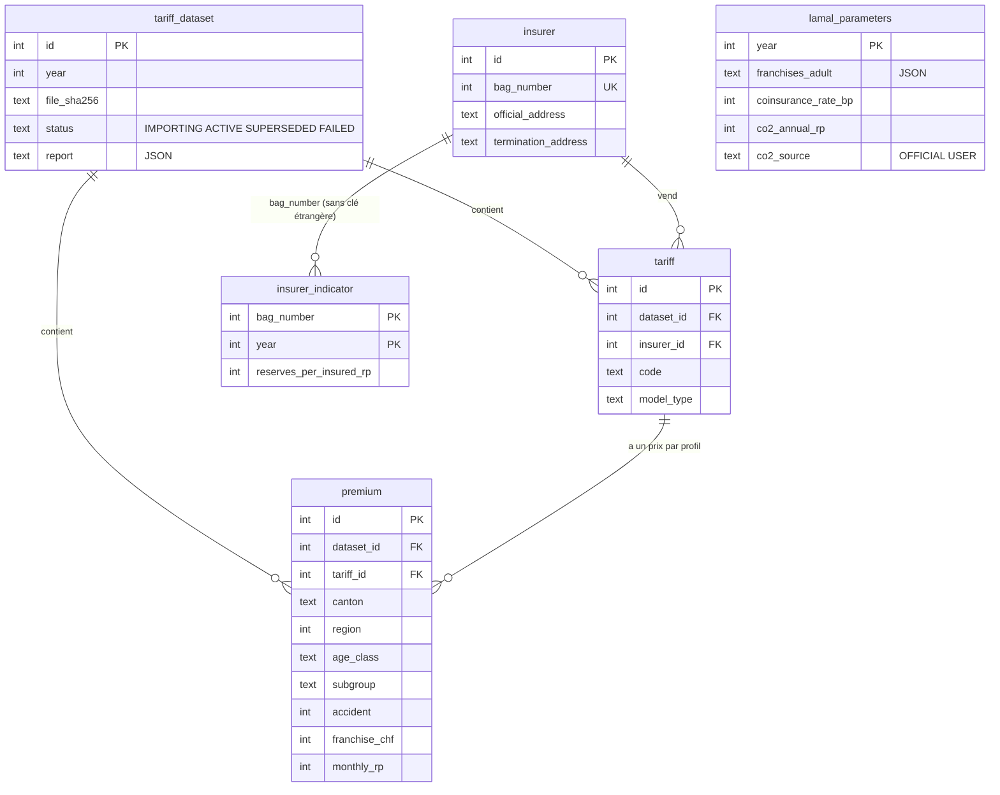
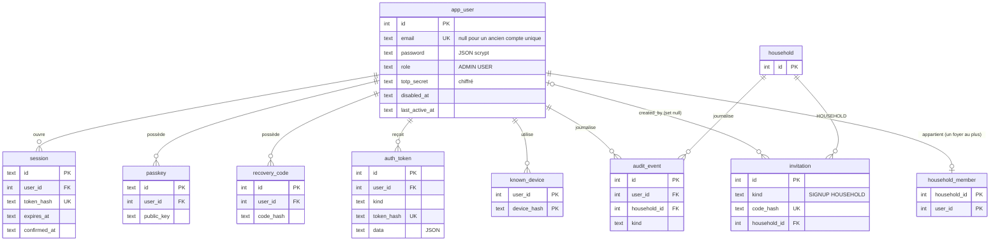
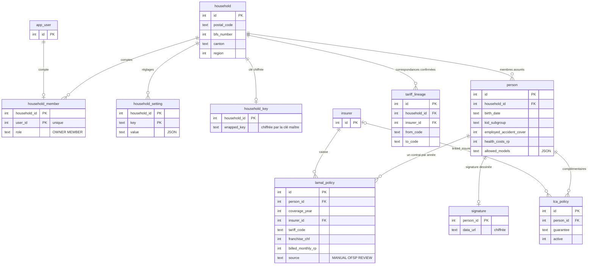
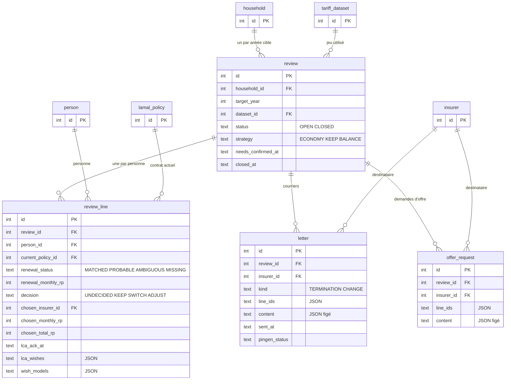

# Modèle de données

Toute la base est un seul fichier SQLite, décrit en TypeScript par Drizzle dans
[`src/infrastructure/db/schema.ts`](../src/infrastructure/db/schema.ts). Ce document en donne la
carte : les tables par zone, leurs liens, les conventions de colonnes, les valeurs d'état et
l'historique des migrations.

Les notions métier (franchise, reconduction, rituel…) sont expliquées dans
[concepts.md](concepts.md). Seul `src/infrastructure` lit et écrit ces tables ; les règles de
cloisonnement des foyers sont dans [architecture.md](architecture.md).

## Vue d'ensemble

| Zone | Tables | Qui y écrit |
|---|---|---|
| Référentiel OFSP | `tariff_dataset`, `tariff`, `premium`, `insurer`, `insurer_indicator`, `lamal_parameters` | Imports automatiques et administrateur ; partagé par tous les foyers |
| Comptes et sécurité | `app_user`, `session`, `passkey`, `recovery_code`, `auth_token`, `invitation`, `known_device`, `audit_event` | Inscription, connexion, *Mon compte* |
| Foyer | `household`, `household_member`, `household_setting`, `household_key`, `person`, `lamal_policy`, `lca_policy`, `tariff_lineage`, `signature` | Le foyer lui-même |
| Rituel | `review`, `review_line`, `letter`, `offer_request` | Le foyer, pendant le rituel |
| Divers | `settings`, `push_subscription`, `notification_log`, `feedback`, `usage_counter` | App et tâches de fond |

Toute donnée d'un foyer se rattache à `household`, directement ou par `person` ou `review`.
Supprimer un foyer supprime donc tout son contenu en cascade.

## Diagrammes par zone

Les diagrammes ne montrent que les clés et quelques colonnes utiles ; la liste complète est
dans `schema.ts`. Une table d'une autre zone apparaît avec ses seules clés.

### Référentiel OFSP

- `premium` porte une contrainte d'unicité sur (tarif, canton, région, classe d'âge, sous-groupe,
  accident, franchise) et un index de recherche `premium_lookup`.
- `insurer.termination_address`, saisie par l'utilisateur, est prioritaire sur
  `official_address` (annuaire OFSP, mise à jour seule).

### Comptes et sécurité

### Foyer

- `lamal_policy` : un seul contrat par personne et par année (`lamal_policy_person_year`).
- `household_member.user_id` est unique : un compte n'a qu'un foyer.

### Rituel

- `review` : un seul rituel par foyer et par année cible (`review_household_year`).
- `review_line` : une seule ligne par personne et par rituel (`review_line_person`).
- Les colonnes `renewal_*` décrivent la reconduction tacite ; `chosen_*` figent le choix ;
  `wish_*` et `lca_wishes` gardent les besoins exprimés pour ce rituel.

### Divers

| Table | Contenu |
|---|---|
| `settings` | Réglages globaux de l'instance, une valeur JSON par clé (`SETTING_KEYS` dans `src/infrastructure/db/settings.ts`) |
| `push_subscription` | Appareil abonné aux notifications, rattaché à un compte (cascade) |
| `notification_log` | Clés des notifications déjà envoyées, pour ne jamais envoyer deux fois le même rappel |
| `feedback` | Avis envoyé depuis l'app (`PROBLEM`, `IDEA`, `OTHER`), supprimé avec le compte (cascade) |
| `usage_counter` | Totaux de l'instance (`accounts.created`, `letters.sent`), jamais par compte ni par foyer |

## Conventions de colonnes

| Convention | Exemple | Règle |
|---|---|---|
| Montant en centimes | `monthly_rp`, `billed_monthly_rp` | Entier. Jamais de nombre à virgule pour de l'argent. Conversion par `src/domain/money.ts`. |
| Montant en francs entiers | `franchise_chf` | Seulement pour les franchises, toujours des francs ronds. |
| Taux | `coinsurance_rate_bp` | Points de base (`1000` = 10 %). |
| Date civile | `birth_date`, `start_date` | Texte `AAAA-MM-JJ` (type `IsoDate`). |
| Instant | `created_at`, `sent_at`, `*_at` | Texte ISO 8601 en UTC, rempli par `nowIso()` ou par défaut SQL `strftime(...)`. |
| Booléen | `accident`, `active` | Entier 0/1 (`mode: "boolean"` côté Drizzle). |
| JSON | `content`, `line_ids`, `allowed_models`, `report` | Texte JSON (`mode: "json"`), typé par `$type<…>()`. |
| Énumération | `status`, `decision`, `role` | Texte en MAJUSCULES anglaises ; la liste est déclarée dans `schema.ts` mais **pas** vérifiée par SQLite. |
| Haché | `token_hash`, `code_hash`, `device_hash`, `password` | Jamais la valeur en clair : SHA-256, ou scrypt pour le mot de passe. |
| Chiffré | `signature.data_url`, `app_user.totp_secret`, `household_key.wrapped_key` | AES-256-GCM (`src/infrastructure/crypto/vault.ts`) : signature par la clé du foyer ; secret TOTP et clé du foyer par la clé maître. Le secret TOTP en cours d'activation est aussi chiffré dans `auth_token.data`. |

Quelques noms de propriété TypeScript diffèrent du nom de colonne : `letter.generatedAt`,
`offerRequest.generatedAt` et `tariffDataset.importedAt` sont tous stockés dans `created_at`.

### Suppressions en cascade

- `ON DELETE CASCADE` : tout ce qui dépend d'un foyer, d'une personne, d'un rituel ou d'un compte
  (personnes, contrats, lignes, lettres, sessions, passkeys, avis…), et `tariff`/`premium` d'un
  jeu de primes.
- `ON DELETE SET NULL` : `invitation.created_by` (l'invitation survit à son auteur).
- **Sans cascade** (la suppression est refusée tant qu'une ligne y renvoie) : les références à
  `insurer`, `review.dataset_id` et `review_line.current_policy_id`. Par exemple, un contrat
  utilisé par un rituel ne peut pas être supprimé ; l'action traduit l'erreur SQLite en message
  lisible (`rethrowForeignKey` dans `src/server/action.ts`).

`PRAGMA foreign_keys = ON` et `PRAGMA secure_delete = ON` sont posés à l'ouverture
(`openDb()` dans `src/infrastructure/db/client.ts`).

## Valeurs enregistrées à ne pas renommer

Certaines chaînes sont écrites telles quelles dans la base. Les renommer dans le code casse les
données existantes, sauf à écrire une migration qui les convertit.

| Où | Valeurs |
|---|---|
| Toutes les colonnes d'énumération | `OPEN`, `SWITCH`, `TERMINATION`, `STANDARD`, `KID`, etc. |
| `letter.content`, `offer_request.content` | Champs de `LetterContent` (`src/domain/letter.ts`) : `senderLines`, `subject`, `paragraphs`, `personRows`, `mailing`, `extraRows`… Une lettre ancienne doit rester lisible. |
| `review_line.lca_wishes`, `lca_policy.guarantee` | Clés `LcaGuarantee` (`src/domain/lca.ts`) |
| `review_line.wish_models`, `person.allowed_models` | Valeurs de `ModelType` |
| `settings.key` | `ofsp.lastCheck`, `ofsp.signature`, `ofsp.yearAttempt.AAAA`, `push.vapid`, `reference.*` |
| `household_setting.key` | `mode` (`SOLO`, `FAMILY`), `pingen.enabled` |
| `notification_log.key` | Clés de rappel (`rappel-2027-J7`, `relance-…`, `pingen-echec-…`), préfixées `h<id du foyer>:` pour un foyer |
| `audit_event.kind` | `LOGIN_FAILED`, `PASSWORD_CHANGED`, `PASSKEY_ADDED`… |
| `usage_counter.key` | `accounts.created`, `letters.sent` |
| `letter.pingen_status` | Statuts renvoyés par Pingen, plus `unknown` (`PINGEN_UNKNOWN`) |

## Valeurs d'état

| Colonne | Valeurs | Sens |
|---|---|---|
| `tariff_dataset.status` | `IMPORTING` → `ACTIVE` → `SUPERSEDED`, ou `FAILED` | Un seul jeu `ACTIVE` par année. Un import interrompu reste `IMPORTING` : au démarrage, il passe `FAILED` et ses lignes sont supprimées (`recoverInterruptedImports()`). |
| `review.status` | `OPEN`, `CLOSED` (`DECIDED`, `LETTERS_SENT` : historiques, plus écrits) | Voir [concepts.md](concepts.md#statuts-du-rituel) |
| `review_line.decision` | `UNDECIDED`, `KEEP`, `SWITCH`, `ADJUST` | Voir [concepts.md](concepts.md#décision-dune-ligne) |
| `review_line.renewal_status` | `MATCHED`, `PROBABLE`, `AMBIGUOUS`, `MISSING` | Voir [concepts.md](concepts.md#lignée-de-tarif) |
| `review_line.doctor_check` | `YES`, `NO`, `UNKNOWN` | Médecin dans la liste du modèle |
| `lamal_policy.source` | `MANUAL`, `OFSP`, `REVIEW` | Saisi à la main, saisi avec un tarif officiel, créé par la clôture d'un rituel |
| `letter.kind` | `TERMINATION`, `CHANGE` | Résiliation, ou changement de franchise ou de modèle |
| `auth_token.kind` | `VERIFY_EMAIL`, `RESET_PASSWORD`, `LOGIN_MFA`, `WEBAUTHN`, `TOTP_SETUP` | Usage du jeton à usage unique |
| `invitation.kind` | `SIGNUP`, `HOUSEHOLD` | Créer un compte (administrateur), rejoindre un foyer (propriétaire) |
| `app_user.role` | `ADMIN`, `USER` | Rôle sur l'instance |
| `household_member.role` | `OWNER`, `MEMBER` | Rôle dans le foyer |

## Historique des migrations

Les migrations sont dans [`drizzle/`](../drizzle) (SQL et journal `meta/_journal.json`).

| Migration | Contenu |
|---|---|
| `0000_init` | Schéma de départ : référentiel (`tariff_dataset`, `tariff`, `premium`, `insurer`, `lamal_parameters`), foyer unique (`household`, `person`, `lamal_policy`, `lca_policy`, `tariff_lineage`), rituel (`review`, `review_line`, `letter`), `settings`, `push_subscription`, `notification_log`. |
| `0001_household_commune` | Commune et n° OFS du foyer (`commune`, `bfs_number`). |
| `0002_reference_offers` | Référentiels officiels : `insurer_indicator`, coordonnées de l'annuaire dans `insurer`, `co2_source` ; demandes d'offre (`offer_request`), garanties LCA (`guarantee`, `lca_wishes`). |
| `0003_journey_strategy` | Signature dessinée (`signature`), stratégie et besoins du rituel (`strategy`, `needs_confirmed_at`, `wish_franchise_chf`, `wish_models`). |
| `0004_auth_sessions` | Sessions en base (`session`). |
| `0005_letter_pingen` | Suivi de l'envoi par Pingen dans `letter` (`pingen_*`). |
| `0006_multi_household` | Plusieurs foyers : `app_user`, `household_member`, `household_setting`. L'ancien mot de passe devient le compte administrateur n° 1, propriétaire du foyer existant ; sessions, abonnements push et correspondances de tarif sont rattachés au compte ou au foyer. |
| `0007_accounts` | Comptes complets : `passkey`, `recovery_code`, `auth_token`, `invitation`, `known_device`, `audit_event` ; courriel confirmé, TOTP, consentement et suspension dans `app_user`. Pingen reste autorisé au foyer de l'administrateur existant. |
| `0008_data_protection` | Clé de chiffrement par foyer (`household_key`), dernière activité et rappels d'inactivité, confirmation d'identité de la session (`confirmed_at`). |
| `0009_feedback_usage` | Avis (`feedback`) et compteurs d'usage (`usage_counter`). |

## Modifier le schéma

1. Modifier [`src/infrastructure/db/schema.ts`](../src/infrastructure/db/schema.ts).
2. Lancer `pnpm db:generate` : drizzle-kit compare avec le dernier instantané
   (`drizzle/meta/*_snapshot.json`) et écrit une nouvelle migration SQL numérotée dans `drizzle/`.
   Ne jamais créer une migration à la main (le journal et l'instantané ne suivraient pas), et ne
   jamais modifier une migration déjà publiée : des bases l'ont déjà appliquée.
3. Relire le SQL produit. Pour une colonne `NOT NULL` ajoutée à une table existante, prévoir une
   valeur par défaut. Pour une conversion de données, ajouter les `UPDATE` nécessaires dans le
   fichier qui vient d'être généré (avant tout commit), comme le font `0002` et `0006`.
4. Lancer les tests : chaque test ouvre une base neuve et applique toutes les migrations. Pour une
   conversion de données, s'inspirer de `tests/unit/multi-household-migration.test.ts`, qui
   applique le journal jusqu'à une migration, insère des données, puis applique la suite.

**Au démarrage**, `openDb()` (`src/infrastructure/db/client.ts`) applique les migrations en
attente :

- s'il y en a et que la base existe déjà, elle est d'abord **copiée** dans
  `<dossier de la base>/backups/lamal-<date>.db` (`VACUUM INTO`) ; seules les **cinq** dernières
  copies sont gardées ;
- les copies de plus de **30 jours** sont supprimées à chaque ouverture (`pruneOldBackups()`) ;
- si une migration échoue, la transaction est annulée, le journal indique la copie à restaurer et
  l'app ne démarre pas.

Le dossier des migrations est `drizzle/` à côté du processus, ou `MIGRATIONS_DIR` (voir
[configuration](exploitation/configuration.md)). La restauration d'une copie est décrite dans
[sauvegarde-restauration](exploitation/sauvegarde-restauration.md).
